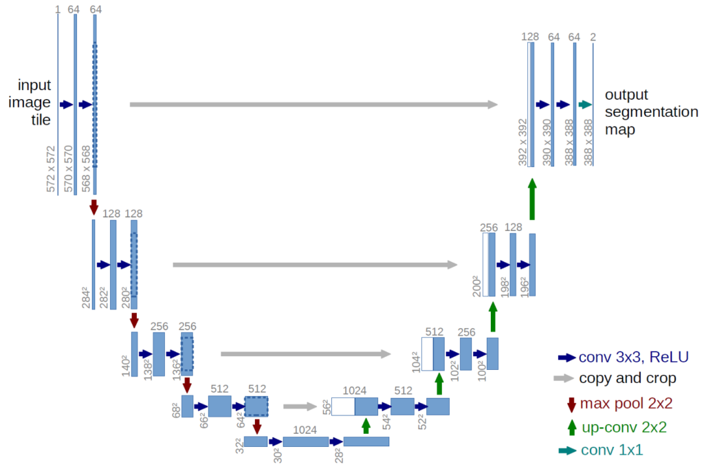

# UNet-Autoencoder
<h2><strong>Brief Introduction</strong></h2>

U-Net is a convolutional neural network that was developed for biomedical image segmentation at the Computer Science Department of the University of Freiburg, Germany. The network is based on the fully convolutional network and its architecture was modified and extended to work with fewer training images and to yield more precise segmentations.

<h2><strong>Network Architecture</strong></h2>

The network consists of a contracting path and an expansive path, which gives it the u-shaped architecture. The contracting path is a typical convolutional network that consists of repeated application of convolutions, each followed by a rectified linear unit (ReLU) and a max pooling operation. During the contraction, the spatial information is reduced while feature information is increased. The expansive pathway combines the feature and spatial information through a sequence of up-convolutions and concatenations with high-resolution features from the contracting path

<h2><strong>Applications</strong></h2>

There are many applications of U-Net in biomedical image segmentation, such as brain image segmentation (''BRATS') and liver image segmentation ("siliver07"). Variations of the U-Net have also been applied for medical image reconstruction. Here are some variants and applications of U-Net as follows:
<ol><li>Pixel-wise regression using U-Net and its application on pansharpening</li>
<li>3D U-Net: Learning Dense Volumetric Segmentation from Sparse Annotation</li>
<li>TernausNet: U-Net with VGG11 Encoder Pre-Trained on ImageNet for Image Segmentation</li></ol>

